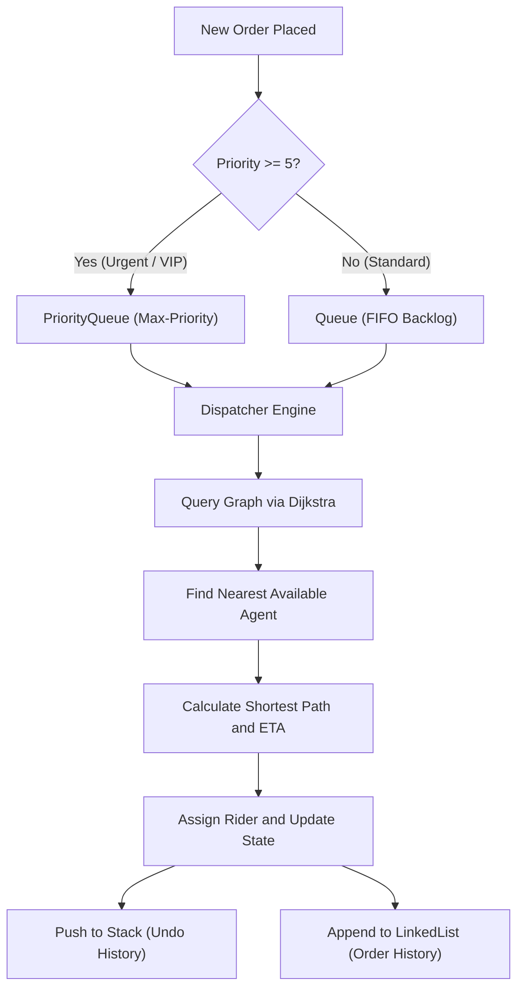

<div align="center">

# SpeedEats — Food Delivery Simulator

A high-performance C++ food delivery routing simulator utilizing custom Abstract Data Types (ADTs) and graph algorithms to optimize order queues, shortest-path rider dispatch, and ETA calculation.

[](https://en.cppreference.com/)
[](https://nu.edu.pk/)
[](https://en.wikipedia.org/wiki/Dijkstra%27s_algorithm)
[](#data-structures--complexity)

</div>

---

### Navigation

[Overview](#project-overview) · [Core Data Structures](#core-data-structures--complexity) · [Network Model](#network-model--routing) · [Features](#key-capabilities) · [Project Structure](#project-structure) · [Build & Run](#build--execution) · [Usage Guide](#interactive-console-workflow) · [Author](#author)

---

## Project Overview

Logistics and on-demand delivery networks require low-latency dispatching, shortest-path traversal, and robust queue management under variable operational loads. 

**SpeedEats** simulates a metropolitan delivery network (set in Karachi, Pakistan) that models real-world road intersections, restaurant hubs, customer delivery points, and active delivery agents. The system is written entirely in **C++** without reliance on Standard Template Library (STL) container abstractions (`std::vector`, `std::queue`, `std::stack`, `std::map`). Every core Abstract Data Type—including singly linked lists, FIFO queues, LIFO event stacks, binary search trees, priority queues, and weighted graphs—is implemented natively from scratch using C++ templates and explicit pointer manipulation.

> **Academic Note:** Developed as part of the Data Structures (DSA) coursework at FAST-NUCES under the instruction of Ms. Fizza Aqeel.

---

## Core Data Structures & Complexity

All ADTs are implemented with custom generic templates located directly in `project.cpp`.



### ADT Specifications

| Data Structure | Implementation Details | Operations Supported | Time Complexity | Purpose in System |
|---|---|---|:---:|---|
| **`LinkedList<T>`** | Dynamic node-linked linear chain with head/tail tracking | `insert()`, `display()`, `find()`, `remove()` | Insertion: $O(1)$<br>Search: $O(n)$ | Manages user directories, delivery agents, restaurant catalog, and persistent order histories. |
| **`Queue<T>`** | Linked FIFO queue with front and rear pointers | `enqueue()`, `dequeue()`, `peek()`, `isEmpty()` | Enqueue: $O(1)$<br>Dequeue: $O(1)$ | Buffers non-urgent delivery orders and backlogs when riders are busy. |
| **`Stack<T>`** | Linked LIFO stack with top-pointer push/pop | `push()`, `pop()`, `top()`, `isEmpty()` | Push: $O(1)$<br>Pop: $O(1)$ | Tracks dispatch transactions to power an instant single-step "Undo" operation (reverting assignments and agent availability). |
| **`PriorityQueue`** | Array-backed dynamic max-heap based on order urgency (1–10) | `enqueue(order, priority)`, `dequeue()`, `peek()` | Enqueue: $O(\log n)$<br>Extract-Max: $O(\log n)$ | Schedules urgent orders (priority $\ge 5$) ahead of standard orders. |
| **`BST`** | Binary Search Tree ordered alphabetically by restaurant name | `insert()`, `search()`, `inorder()` | Search (avg): $O(\log n)$<br>Search (worst): $O(n)$ | Enables fast search and alphabetical listing of restaurants. |
| **`Graph`** | Weighted undirected adjacency list representation | `addEdge()`, `dijkstra()`, `printGraph()` | Dijkstra: $O(V^2)$<br>Edge Lookup: $O(E)$ | Models street topologies, computes exact road distance (km), and derives estimated delivery times (ETA). |

---

## Network Model & Routing

The simulation models an undirected road network composed of 10 primary nodes connected by weighted road edges representing Karachi thoroughfares:

### Network Topology

```text
  [0: Pizza Palace] -------(5 km)------- [1: Burger King] -------(4 km)------- [2: Sushi Station]
          |                                      |                                      |
       (8 km)                                 (7 km)                                 (5 km)
          |                                      |                                      |
  [5: Green Valley]                      [6: Blue Heights]                      [7: Red Square]
                                                                                        |
  [4: Pasta Paradise] ----(4 km)---- [3: Taco Town] -------(9 km)------- [8: Golden Plaza]
                                                                                        |
                                                                                     (3 km)
                                                                                        |
                                                                                [9: Silver Street]
```

- **Restaurant Hubs (Nodes 0–4):** Pizza Palace (0), Burger King (1), Sushi Station (2), Taco Town (3), Pasta Paradise (4).
- **Delivery Zones (Nodes 5–9):** Green Valley (5), Blue Heights (6), Red Square (7), Golden Plaza (8), Silver Street (9).
- **Routing Engine:** Employs Dijkstra's Single-Source Shortest Path algorithm to find the closest idle agent to the restaurant node, then calculates the shortest route and ETA from the restaurant to the user destination.

---

## Key Capabilities

- **Pure ADT Design:** Zero dependence on STL container classes (`vector`, `queue`, `stack`, `map`) for internal operational storage.
- **Dual-Queue Priority Dispatching:** Orders with priority $\ge 5$ are queued into the `PriorityQueue` for expedited dispatch, while standard orders reside in a FIFO `Queue`.
- **Dijkstra-Powered Dispatch:** Dynamically evaluates all available delivery agents and assigns the one with the minimal travel distance to the fulfillment restaurant.
- **Distance & ETA Modeling:** Computes travel distances in kilometers and translates road weights into realistic travel times (minutes) based on route complexity.
- **Single-Step Undo System:** Any accidental or misallocated rider assignment can be instantly undone via the LIFO `Stack`, returning the order to the queue and freeing the agent.
- **BST Restaurant Indexing:** Binary Search Tree implementation enabling logarithmic-time search by restaurant name and alphabetical directory printing via in-order traversal.
- **CSV Data Ingestion:** Automated ingestion for road topologies, restaurant directories, delivery agents, and user records from structured CSV files.

---

## Project Structure

```text
SPEEDEATS---FOOD-DELIVERY-SIMULATOR/
├── project.cpp           # Complete source: custom ADT templates, Graph, and Simulator engine
├── nodes.csv             # Graph vertices (intersections and hub IDs)
├── edges.csv             # Weighted undirected edges (source, destination, distance in km)
├── restaurants.csv       # Restaurant catalog (id, name, nodeId)
├── users.csv             # Customer directory (id, name, nodeId)
├── agents.csv            # Delivery rider directory (id, name, nodeId)
├── orders.csv            # Order records
├── NETWORK_GUIDE.md      # Street connection and node topology guide
├── QUICK_START.md        # Quick reference for compilation and commands
├── USER_GUIDE.md         # Full feature walkthrough and test scenarios
└── README.md             # Project documentation
```

---

## Build & Execution

### Prerequisites

- **C++ Compiler:** `g++` (GCC) with C++17 support or MSVC / Clang.

### Compilation

```bash
# Compile the simulator
g++ -std=c++17 project.cpp -o simulator

# Run the executable
./simulator
```

### On Windows (PowerShell):

```powershell
g++ -std=c++17 project.cpp -o simulator.exe
.\simulator.exe
```

---

## Interactive Console Workflow

Upon launching the simulator, an interactive numeric menu provides access to all simulation modules:

### Step 1: Initialize Network and Entities
1. Select `1` to load road topology: specify `nodes.csv` and `edges.csv`.
2. Select `2` to load restaurant catalog: specify `restaurants.csv`.
3. Select `3` to load registered customers: specify `users.csv`.
4. Select `4` to load available delivery agents: specify `agents.csv`.

### Step 2: Browse & Search
- Select `5`: Display all restaurants sorted alphabetically (via BST in-order traversal).
- Select `6`: Search for a specific restaurant by name (BST search).
- Select `7`: View customer directory.
- Select `8`: Inspect delivery agents and their availability status.

### Step 3: Order Lifecycle & Dispatch
- Select `9`: Create a new order by entering `User ID`, `Restaurant ID`, and `Priority` (1–10).
- Select `10`: Run the automated dispatcher:
  - Processes high-priority orders from `PriorityQueue`.
  - Processes backlog orders from standard FIFO `Queue`.
  - Computes the shortest path from each idle agent to the target restaurant.
  - Computes path and ETA from restaurant to customer.
- Select `11`: **Undo** the last dispatch action (pops assignment from `Stack` and resets rider status).
- Select `12`: View complete historical delivery log (traverses `LinkedList`).
- Select `13`: Display pending order queue counts.

---

## Author

**Muhammad Hasan Dad Khan**  
Computer Science — FAST-NUCES  

*Project developed in collaboration with Ali Zeeshan and Zaid Amir as part of the Data Structures (DSA) coursework at FAST-NUCES under the instruction of Ms. Fizza Aqeel.*\n